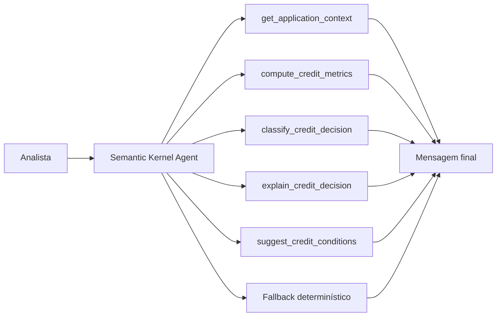

# Agente Analise de Credito

Um MVP de `Semantic Kernel` para análise de crédito inteligente. O projeto foi desenhado para interpretar propostas de crédito, calcular métricas heurísticas de underwriting, classificar a decisão, explicar o racional e sugerir condições ou mitigantes, sempre grounded no contexto consultado.

## Visão Geral

O sistema responde perguntas como:

- a proposta deveria ser aprovada, revisada manualmente ou recusada?
- o endividamento e a parcela estão compatíveis com a renda?
- há sinais de inadimplência ou utilização alta pesando na decisão?
- quais condições fariam sentido em um cenário de risco moderado?

## Arquitetura



## Topologia de Execução

O projeto foi estruturado em quatro camadas:

1. `application layer`
   - carrega o contexto da proposta;
2. `credit analytics layer`
   - calcula métricas de renda, endividamento, score e risco;
3. `agent orchestration layer`
   - usa `Semantic Kernel` com plugin e `ChatCompletionAgent` quando o runtime está disponível;
4. `presentation layer`
   - expõe o fluxo via `CLI` e `Streamlit`.

## Estrutura do Projeto

- [src/sample_data.py](/Users/flaviagaia/Documents/CV_FLAVIA_CODEX/agente_analisedecredito/src/sample_data.py)
  - base demo de propostas de crédito.
- [src/tools.py](/Users/flaviagaia/Documents/CV_FLAVIA_CODEX/agente_analisedecredito/src/tools.py)
  - tools de cálculo, classificação e explicação.
- [src/agent.py](/Users/flaviagaia/Documents/CV_FLAVIA_CODEX/agente_analisedecredito/src/agent.py)
  - orquestração com `Semantic Kernel` e fallback.
- [app.py](/Users/flaviagaia/Documents/CV_FLAVIA_CODEX/agente_analisedecredito/app.py)
  - console técnico em `Streamlit`.
- [main.py](/Users/flaviagaia/Documents/CV_FLAVIA_CODEX/agente_analisedecredito/main.py)
  - execução rápida e persistência do relatório.
- [tests/test_agent.py](/Users/flaviagaia/Documents/CV_FLAVIA_CODEX/agente_analisedecredito/tests/test_agent.py)
  - validação do fluxo principal.

## Como o Semantic Kernel foi modelado

O runtime planejado usa:

- `Kernel`
  - composição do ambiente do agente;
- `ChatCompletionAgent`
  - agente de chat com acesso a funções;
- `ChatHistoryAgentThread`
  - thread de execução;
- plugin com `@kernel_function`
  - encapsulando as funções de underwriting.

### Decisões de design

- `Kernel`
  - usado como contêiner explícito da composição do runtime agentic;
- `ChatCompletionAgent`
  - escolhido como agente principal por permitir interação com funções e construção de resposta final grounded;
- plugin com `@kernel_function`
  - adotado para separar a lógica de underwriting do runtime conversacional;
- `deterministic_fallback`
  - preserva o contrato de saída em ambiente local sem dependência obrigatória do framework ou da API key;
- `application grounding`
  - garante que a resposta final dependa apenas da proposta consultada e das métricas derivadas.

Essa separação organiza o projeto em:

- camada de dados da proposta;
- camada de analytics de crédito;
- camada de orquestração agentic;
- camada de apresentação.

### Functions registradas

- `get_application_context`
- `compute_credit_metrics`
- `classify_credit_decision`
- `explain_credit_decision`
- `suggest_credit_conditions`

### Runtime modes

1. `semantic_kernel_agent`
   - usado quando há runtime compatível e `OPENAI_API_KEY`;
2. `deterministic_fallback`
   - usado para execução local reprodutível.

### Contrato funcional entre functions e agente

O agente foi desenhado para consolidar a resposta final em quatro estágios:

1. recuperação do contexto da proposta;
2. derivação das métricas heurísticas de crédito;
3. classificação da decisão e da banda de risco;
4. composição do racional e das condições sugeridas.

Isso faz com que o agente atue como um `credit decision orchestrator`, e não apenas como um gerador livre de texto.

## Tools de Crédito

### `compute_credit_metrics`
Calcula:

- `installment_estimate_br`
- `debt_to_income_ratio`
- `installment_to_income_ratio`
- `risk_flags`

Formulações do MVP:

- `installment_estimate_br = requested_amount_br / term_months`
- `debt_to_income_ratio = monthly_debt_obligations_br / monthly_income_br`
- `installment_to_income_ratio = installment_estimate_br / monthly_income_br`

Heurísticas principais:

- `credit_score < 620`
  - sinaliza score baixo;
- `delinquencies_12m >= 2`
  - sinaliza inadimplência recente;
- `credit_utilization_pct >= 75`
  - sinaliza utilização alta;
- `debt_to_income_ratio >= 0.40`
  - sinaliza endividamento elevado;
- `installment_to_income_ratio >= 0.30`
  - sinaliza parcela pesada;
- `employment_months < 12`
  - sinaliza menor estabilidade profissional.

### `classify_credit_decision`
Gera:

- `decision`
- `risk_band`
- `risk_score`

Score heurístico aplicado:

- `+2` para score baixo
- `+2` para inadimplência recente
- `+1` para utilização alta
- `+1` para endividamento elevado
- `+1` para parcela pesada
- `+1` para estabilidade profissional curta

Mapeamento final:

- `score >= 5` -> `decline` / `alto`
- `2 <= score < 5` -> `manual_review` / `moderado`
- `score < 2` -> `approve` / `baixo`

### `explain_credit_decision`
Produz um racional executivo grounded.

Essa camada funciona como um `decision explainer`, conectando:

- fatores quantitativos;
- bandeira de risco;
- decisão sugerida;
- pressão estimada da parcela sobre a renda.

### `suggest_credit_conditions`
Propõe condições ou mitigantes para aprovação, revisão ou recusa.

As condições são condicionadas pela decisão:

- `approve`
  - manutenção das condições solicitadas;
- `manual_review`
  - mitigantes, documentação complementar e revisão de alçada;
- `decline`
  - reestruturação do pedido ou orientação de elegibilidade futura.

## Modelo de Dados

As propostas demo incluem:

- `application_id`
- `customer_name`
- `requested_amount_br`
- `term_months`
- `monthly_income_br`
- `monthly_debt_obligations_br`
- `credit_score`
- `employment_months`
- `delinquencies_12m`
- `credit_utilization_pct`
- `existing_loans`
- `customer_segment`

## Exemplo de Proposta

```json
{
  "application_id": "CR-1002",
  "customer_name": "Diego Pereira",
  "requested_amount_br": 45000,
  "term_months": 36,
  "monthly_income_br": 5100,
  "monthly_debt_obligations_br": 2300,
  "credit_score": 598,
  "employment_months": 11,
  "delinquencies_12m": 2,
  "credit_utilization_pct": 82,
  "existing_loans": 3,
  "customer_segment": "mass_market"
}
```

## Contrato de Saída

`ask_credit_analysis_agent()` retorna:

```json
{
  "runtime_mode": "semantic_kernel_agent | deterministic_fallback",
  "application_id": "CR-1002",
  "application": {},
  "credit_metrics": {},
  "classification": {},
  "decision_explanation": "texto",
  "recommended_conditions": {},
  "final_message": "texto final"
}
```

### Semântica do retorno

- `runtime_mode`
  - identifica se a resposta veio do `Semantic Kernel` ou do fallback local;
- `application`
  - snapshot canônico da proposta consultada;
- `credit_metrics`
  - camada quantitativa de underwriting;
- `classification`
  - decisão e banda de risco;
- `decision_explanation`
  - racional executivo da decisão;
- `recommended_conditions`
  - conjunto de mitigantes ou condições recomendadas;
- `final_message`
  - mensagem final consolidada entregue ao usuário.

Esse contrato único facilita integração posterior com APIs, pipelines de decisão ou trilhas de auditoria.

## Persistência e Artefatos

O script [main.py](/Users/flaviagaia/Documents/CV_FLAVIA_CODEX/agente_analisedecredito/main.py) gera o artefato:

- `data/processed/credit_analysis_report.json`

Esse arquivo é produzido em runtime para auditoria local e não faz parte dos arquivos versionados do repositório.

Do ponto de vista arquitetural, esse artefato pode ser reaproveitado como:

- `execution snapshot`;
- `audit trail`;
- base de comparação entre versões do agente;
- payload para integração com motores de decisão.

## Interface Streamlit

O app funciona como um `inspection console` para:

- selecionar a proposta;
- submeter uma pergunta analítica;
- inspecionar métricas, decisão e condições;
- comparar a mensagem final com a proposta consultada.

Na prática, o Streamlit atua como uma `debuggable presentation layer`, permitindo:

- verificar coerência entre métricas e decisão;
- comparar decisão, banda de risco e mitigantes;
- validar o contrato de retorno sem depender apenas do código;
- demonstrar o fluxo para times técnicos, de risco e produto.

## Validação

Os testes em [tests/test_agent.py](/Users/flaviagaia/Documents/CV_FLAVIA_CODEX/agente_analisedecredito/tests/test_agent.py) verificam:

- presença de `risk_flags` nas métricas;
- retorno de decisão válida;
- existência de mensagem final consolidada.

Além disso, o projeto foi validado com:

```bash
python3 main.py
python3 -m unittest discover -s tests -v
python3 -m py_compile app.py src/agent.py src/tools.py src/sample_data.py main.py
```

## Execução Local

### Pipeline principal

```bash
python3 main.py
```

### Testes

```bash
python3 -m unittest discover -s tests -v
```

### Interface

```bash
streamlit run app.py
```

## Limitações

- base demo pequena;
- score heurístico simples;
- runtime real depende de `Semantic Kernel` + `OPENAI_API_KEY`;
- fallback determinístico para portabilidade local.

## Roadmap Técnico

Possíveis evoluções para uma versão mais robusta:

- adicionar pricing e taxa sugerida por banda de risco;
- incorporar histórico temporal do cliente;
- incluir explicabilidade por feature;
- conectar o agente a políticas parametrizáveis de crédito;
- persistir decisões e revisões manuais em banco;
- observar drift entre decisões heurísticas e revisões humanas.

## English Version

`Agente Analise de Credito` is a `Semantic Kernel` MVP for intelligent credit analysis. The project interprets loan applications, computes heuristic underwriting metrics, classifies a credit decision, explains the rationale, and suggests approval conditions or mitigants. When the Semantic Kernel runtime is unavailable, a deterministic fallback preserves the same output contract for local reproducibility.

### Technical Highlights

- `Kernel` + `ChatCompletionAgent` orchestration
- plugin-based credit analysis functions via `kernel_function`
- deterministic fallback for local execution
- structured credit application context as the grounding layer
- Streamlit inspection console
- explicit separation between application, analytics, orchestration, and presentation layers
- heuristic underwriting score combining delinquency, score, utilization, DTI, and employment stability
- persisted runtime artifact generated at execution time in `data/processed/credit_analysis_report.json`
