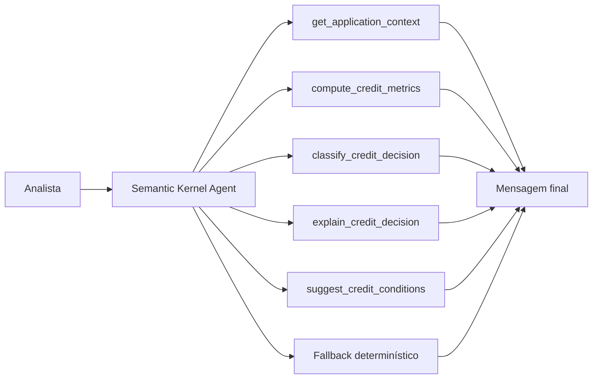

# Agente Analise de Credito

Um MVP de `Semantic Kernel` para análise de crédito inteligente. O projeto foi desenhado para interpretar propostas de crédito, calcular métricas heurísticas de underwriting, classificar a decisão, explicar o racional e sugerir condições ou mitigantes, sempre grounded no contexto consultado.

## Visão Geral

O sistema responde perguntas como:

- a proposta deveria ser aprovada, revisada manualmente ou recusada?
- o endividamento e a parcela estão compatíveis com a renda?
- há sinais de inadimplência ou utilização alta pesando na decisão?
- quais condições fariam sentido em um cenário de risco moderado?

## Arquitetura



## Topologia de Execução

O projeto foi estruturado em quatro camadas:

1. `application layer`
   - carrega o contexto da proposta;
2. `credit analytics layer`
   - calcula métricas de renda, endividamento, score e risco;
3. `agent orchestration layer`
   - usa `Semantic Kernel` com plugin e `ChatCompletionAgent` quando o runtime está disponível;
4. `presentation layer`
   - expõe o fluxo via `CLI` e `Streamlit`.

## Estrutura do Projeto

- [src/sample_data.py](/Users/flaviagaia/Documents/CV_FLAVIA_CODEX/agente_analisedecredito/src/sample_data.py)
  - base demo de propostas de crédito.
- [src/tools.py](/Users/flaviagaia/Documents/CV_FLAVIA_CODEX/agente_analisedecredito/src/tools.py)
  - tools de cálculo, classificação e explicação.
- [src/agent.py](/Users/flaviagaia/Documents/CV_FLAVIA_CODEX/agente_analisedecredito/src/agent.py)
  - orquestração com `Semantic Kernel` e fallback.
- [app.py](/Users/flaviagaia/Documents/CV_FLAVIA_CODEX/agente_analisedecredito/app.py)
  - console técnico em `Streamlit`.
- [main.py](/Users/flaviagaia/Documents/CV_FLAVIA_CODEX/agente_analisedecredito/main.py)
  - execução rápida e persistência do relatório.
- [tests/test_agent.py](/Users/flaviagaia/Documents/CV_FLAVIA_CODEX/agente_analisedecredito/tests/test_agent.py)
  - validação do fluxo principal.

## Como o Semantic Kernel foi modelado

O runtime planejado usa:

- `Kernel`
  - composição do ambiente do agente;
- `ChatCompletionAgent`
  - agente de chat com acesso a funções;
- `ChatHistoryAgentThread`
  - thread de execução;
- plugin com `@kernel_function`
  - encapsulando as funções de underwriting.

### Functions registradas

- `get_application_context`
- `compute_credit_metrics`
- `classify_credit_decision`
- `explain_credit_decision`
- `suggest_credit_conditions`

### Runtime modes

1. `semantic_kernel_agent`
   - usado quando há runtime compatível e `OPENAI_API_KEY`;
2. `deterministic_fallback`
   - usado para execução local reprodutível.

## Tools de Crédito

### `compute_credit_metrics`
Calcula:

- `installment_estimate_br`
- `debt_to_income_ratio`
- `installment_to_income_ratio`
- `risk_flags`

### `classify_credit_decision`
Gera:

- `decision`
- `risk_band`
- `risk_score`

### `explain_credit_decision`
Produz um racional executivo grounded.

### `suggest_credit_conditions`
Propõe condições ou mitigantes para aprovação, revisão ou recusa.

## Modelo de Dados

As propostas demo incluem:

- `application_id`
- `customer_name`
- `requested_amount_br`
- `term_months`
- `monthly_income_br`
- `monthly_debt_obligations_br`
- `credit_score`
- `employment_months`
- `delinquencies_12m`
- `credit_utilization_pct`
- `existing_loans`
- `customer_segment`

## Exemplo de Proposta

```json
{
  "application_id": "CR-1002",
  "customer_name": "Diego Pereira",
  "requested_amount_br": 45000,
  "term_months": 36,
  "monthly_income_br": 5100,
  "monthly_debt_obligations_br": 2300,
  "credit_score": 598,
  "employment_months": 11,
  "delinquencies_12m": 2,
  "credit_utilization_pct": 82,
  "existing_loans": 3,
  "customer_segment": "mass_market"
}
```

## Contrato de Saída

`ask_credit_analysis_agent()` retorna:

```json
{
  "runtime_mode": "semantic_kernel_agent | deterministic_fallback",
  "application_id": "CR-1002",
  "application": {},
  "credit_metrics": {},
  "classification": {},
  "decision_explanation": "texto",
  "recommended_conditions": {},
  "final_message": "texto final"
}
```

## Persistência e Artefatos

O script [main.py](/Users/flaviagaia/Documents/CV_FLAVIA_CODEX/agente_analisedecredito/main.py) gera o artefato:

- `data/processed/credit_analysis_report.json`

Esse arquivo é produzido em runtime para auditoria local e não faz parte dos arquivos versionados do repositório.

## Interface Streamlit

O app funciona como um `inspection console` para:

- selecionar a proposta;
- submeter uma pergunta analítica;
- inspecionar métricas, decisão e condições;
- comparar a mensagem final com a proposta consultada.

## Execução Local

### Pipeline principal

```bash
python3 main.py
```

### Testes

```bash
python3 -m unittest discover -s tests -v
```

### Interface

```bash
streamlit run app.py
```

## Limitações

- base demo pequena;
- score heurístico simples;
- runtime real depende de `Semantic Kernel` + `OPENAI_API_KEY`;
- fallback determinístico para portabilidade local.

## English Version

`Agente Analise de Credito` is a `Semantic Kernel` MVP for intelligent credit analysis. The project interprets loan applications, computes heuristic underwriting metrics, classifies a credit decision, explains the rationale, and suggests approval conditions or mitigants. When the Semantic Kernel runtime is unavailable, a deterministic fallback preserves the same output contract for local reproducibility.

### Technical Highlights

- `Kernel` + `ChatCompletionAgent` orchestration
- plugin-based credit analysis functions via `kernel_function`
- deterministic fallback for local execution
- structured credit application context as the grounding layer
- Streamlit inspection console
- persisted runtime artifact generated at execution time in `data/processed/credit_analysis_report.json`
